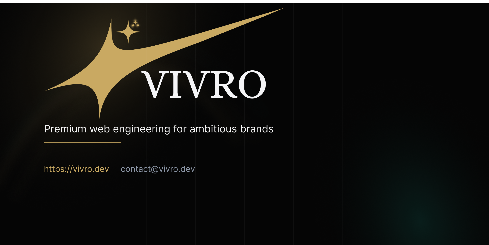
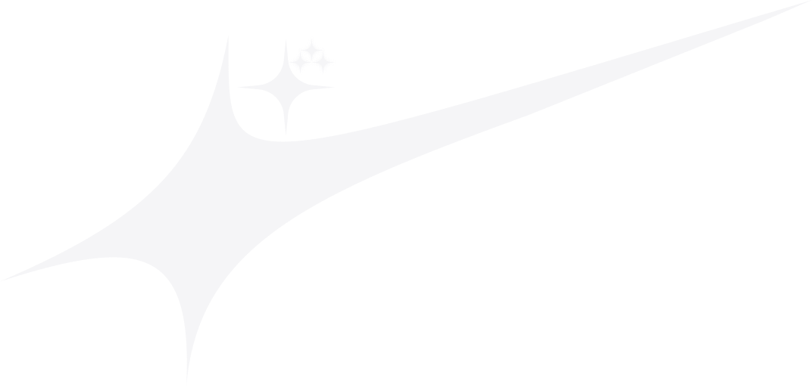

# VIVRO

**Premium web engineering for ambitious brands.**

We build high-performance digital experiences for discerning brands and growth-minded executives who refuse to compromise on quality.

---

## What we do

<table>
  <tr>
    <td width="50%" valign="top">

### Web Platform Engineering

Enterprise-grade web applications built for performance, security, and scale.

- Custom Next.js applications
- Headless CMS integration
- API design & development
- Performance optimization

</td>
    <td width="50%" valign="top">

### Brand Experience Design

Immersive digital experiences that command attention and convert qualified audiences.

- UX strategy & research
- Visual design systems
- Motion & interaction design
- Design-to-code handoff

</td>
  </tr>
  <tr>
    <td width="50%" valign="top">

### Growth Engineering

Technical infrastructure that accelerates revenue and sharpens conversion.

- Conversion optimization
- Analytics & attribution
- A/B testing infrastructure
- SEO & technical marketing

</td>
    <td width="50%" valign="top">

### Retainers & Partnerships

Ongoing engineering partnerships for teams that need senior execution without hiring overhead.

- Feature delivery sprints
- Performance audits
- Design system maintenance
- Production support

</td>
  </tr>
</table>

---

## Selected work

| Project | Industry | Stack | Live |
| --- | --- | --- | --- |
| [**STARADA**](https://starada.vivro.dev/)) | Luxury Mobility & Car Rental | Next.js 16 + TypeScript + shadcn/ui + GSAP | [View](https://starada.vivro.dev/)) |
| [**Atelier Meridian**](https://premium-architecture-studio.vivro.dev/) | Architecture & Interior Design | Next.js 16 + TypeScript + shadcn/ui + GSAP | [View](https://premium-architecture-studio.vivro.dev/) |
| [**VERDANO**](https://verdano.vivro.dev/) | Agriculture | Next.js 16 + TypeScript + shadcn/ui + motion | [View](https://verdano.vivro.dev/) |
| [**SEO Competitor**](https://seocompetitor.vivro.dev/) | SaaS / SEO Tools | Next.js 16 + TypeScript + shadcn/ui + supabase + Gemini API | [View](https://seocompetitor.vivro.dev/) |

More case studies at **[vivro.dev/work](https://vivro.dev/work)**.

---

## Tech stack

  
  
  
  
  
  
  
  

---

## About

**VIVRO** is a premium web engineering studio based in **Agadir, Morocco**, partnering with brands that expect production-grade execution — not template shortcuts.

We care about Core Web Vitals, accessible interfaces, and digital presence that matches the ambition behind the business.

---

## Let's build

Have a project in mind? We'd like to hear about it.

  <a href="https://vivro.dev/contact"><strong>Start a project</strong></a>
  &nbsp;·&nbsp;
  <a href="mailto:contact@vivro.dev">contact@vivro.dev</a>
  &nbsp;·&nbsp;
  <a href="https://wa.me/212688764152">WhatsApp</a>

  <a href="https://vivro.dev">vivro.dev</a>
  &nbsp;·&nbsp;
  Agadir, Morocco

---

Engineering digital presence worthy of your ambition.

